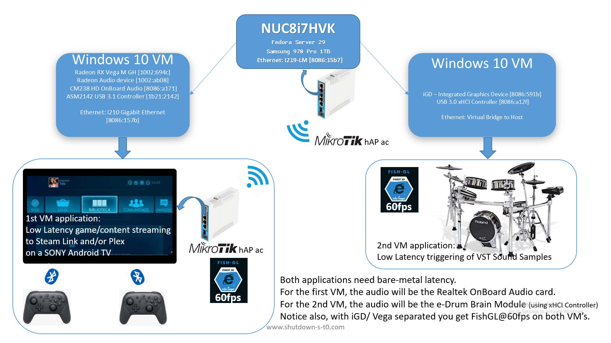

This post was republished to An IT Infrastructure Analys... at 12:24:35
AM 3/25/2019

Complete PCI/GPU Passthrough Setup for Hades Canyon NUC8i7HVK Owners

Category PCI Passthrough

# Introduction

##### Hello Hades Canyon Owners (and other visitors as well),

##### Recently last year I bought a new Intel NUC Hades Canyon. Lovely little computer! 

##### One of the things I was planning for it was to connect it to my e-drum so I could trigger VST’s. I wanted to have a always on “VST Ready” computer. Things were working nice. Then came a new Sony Android TV, and two Nintendo Pro Controllers to go with it, just for fun. It was nice playing Android games for a while.

##### At this point, I was using a Windows 10 installation with all the DAW/VST software configured and had a Vega M RH GPU doing basically nothing, so instead of running games on the Android TV I could run better ones in the Hades Canyon and stream them to the TV, with Steam Link and whatnot. 

##### Things got mixed quickly. I found myself wanting to separate both applications to separate machines, and for me buying a new computer was not an option.

##### I did an experiment with type 2 hypervisors using USB to Ethernet applications, but audio was crackling all over has it had, just by the service overhead itself, two extra layers of latency, one for the host and another for the guest. Not Good.

##### I did another experiment this time passing through the TD-30 e-Drum Module as an USB device to the guest machine, using the same type 2 hypervisor, but the needs were demanding, i needed less than 3ms latency and type 2 hypervisors add extra layers of latency between the host application layer, the hypervisor, and the guest machine, so the audio buffers were just not fast enough. 

##### Hades Canyon is VT-d and VT-x ready, so I started looking into type 1 hypervisors and tried most of them:

##### Windows Server 2019 (and 2016) returned zero compatible devices with Direct Device Assignment when running survey-dda.ps1 script, despite the NUC8i7HVK being VT-d and VT-x compatible.

##### Type 1 Hypervisor Vmware ESXI 6.7:

##### Could not passthrough the Vega M, no matter what, only the iGD.

##### Passed-trough the TD-30 as a USB device successfully, but had no sound output.

##### Later I found that the Hades Canyon had an “issue”, E3-1200 Chipsets and 100 Series/C230 Chipsets were not “ACS friendly”, so I wondered if this could be the reason to these problems. Intel documentation stated:

#### 

#### 

#### 

#### 

So to implement this workaround, what other OS would account for and
access ACSCTLR at Offset 0x148 as described in the Datasheet?

An OS that would allow you to build your own kernel. Linux:

- Arch Linux gave me some issues with the portuguese keyboard layout
  persistent configuration.

- Debian gave me issues installing/starting KDE, with a fresh and recent
  installation.

Then searched for what would be the best Linux distribution for
Virtualization and found several recommendations for Fedora, so I
decided to try it and was satisfied ( it was the most pleasant
experience as everything just worked out of the box ). From here on,
after trying to passthrough the GPU card went from having several host
and guest crashes, to just crashing the guest and actually seeing the
BSOD’s.

After some other tests with different kvm,vfio,pci-stub configurations i
finally had my “Cry of Ipiranga” and was then able to fine tune things
to achieve my desired setup.

Ironically, I ended up configuring everything using the console only.

# Mini-Disclaimer:

This guide is a GUI free guide, console only tutorial. (The reason for
that is I got bored of constantly having to boot into GUI mode to use
Virt-Manager during initial configurations)

Run things in *exact order* because later commands might have
dependencies with previously executed commands or configurations.

1.  This guide is directed to Linux distributions, specifically the
    latest (as of today) Fedora 29 Server.

2.  If you are trying to use another distribution perhaps this guide
    will also help you achieve some of the same goals you have.

3.  Trying another distribution means there may be several command
    syntax differences, so please check your distribution's
    documentation if you want to use another distribution.

4.  It is not a simple guide, it is an advance guide, for advanced users
    but also if you are a beginner as i will do my best to guide you
    through it, with leave no one behind.

5.  This guide is directed mainly to users of Intel Hades Canyon.

6.  If you use other systems or AMD Ryzen CPU's you may also want to
    look at NPT patches for best performance ( not covered in this guide
    )

7.  Please also note that with IOMMU enabled and specially with ACS
    patch applied, there will be DMA from peer to peer, and this may (or
    may not) corrupt your data.

*So, be safe and always backup your important data first!*

# Setup to be implemented:

## Installations in Windows are only going to be covered for the drivers ( see Video )

# 

Note that it is possible to separate both iGD to one VM and Vega M GH.

You can use FishGL to draw fishes on each VM at the same time at 60 fps,
so effectively having 2 guest VM machines with hardware accelerated
graphics.

# What will be needed: 

1.  A router, connected to your virtualization host (to your hades
    canyon) to provide it with local network access, and Internet,
    during and after Fedora installation.

2.  Another computer connected to the same router/local network has your
    host/guests will be, for remote access.

3.  [Rufus](https://github.com/pbatard/rufus/releases) - to create a
    bootable USB drive.

4.  [VNC viewer](https://www.realvnc.com/en/connect/download/viewer/) -
    for remote access to the VM’s displays

5.  [Putty](https://www.chiark.greenend.org.uk/~sgtatham/putty/latest.html) -
    for console/terminal remote access

# List of Steps covered:

1.  Prepare Fedora Server for installation.

2.  Install Fedora Server

3.  Use Putty to connect to host IP

4.  Extend fedora-root partition to be able to build custom kernel

5.  Creating a Host datastore to be shared among VMs

6.  Create a script to check IOMMU Groups and change GRUB initialization
    parameters

7.  Building Custom Kernel with the ACS Patch

8.  Change GRUB initialization parameters for the final ACS and CPU
    configuration

9.  VM CPU Considerations

10. VM deployment

11. HOOK configuration and implementation

12. Create firewall rules for needed services

13. Configure the host virtual network bridge

14. Start the VMs and create a Windows Mapped Drive to the Host
    datastore share.

15. Installing iGD and Radeon RX Vega M RH Drivers

16. Practical Benchmarks.

17. Troubleshooting

# Step 1: Prepare a USB Bootable Drive with Fedora Server Installation ISO

## 1.1 Select ISO. Most of the settings are pre-defined. Press Start

#### 

## 1.2 Press START and choose DD Image mode (this will maintain the source EFI partition structure on the USB drive)

#### 

## 1.3 Reboot, Press F2 to enter BIOS Setup and make these changes:

#### Load defaults ( save your current configuration if you need )

#### 

## 1.5 Make sure the Intel Integrated Graphics Device ( iGD ) is set to Enabled:

#### 

## 1.6 Disable Secureboot ( Mandatory )

#### 

## 1.7 If you have more than one SSD, and want to protect it’s data you have the option to disable it here ( optional )

#### 

#### (specially during the hard drive partitioning of the OS Installation.)

## 1.8 Make sure you are also set to boot from your USB drive connect your Fedora USB drive and restart the computer.

#### Bios -\> Boot -\> Boot Configuration -\> Boot USB Devices First

# Step 2. Install Fedora Server.

#### 

## 2.1 Select your prefered language:

#### 

## 2.2 Change your keyboard layout, In my case Portuguese

#### 

## 2.3 Select Installation Destination

#### Here you should see your disk drive description.

#### 

#### If your disk drive has insufficient space, a popup will show up asking if you want to reclaim the space and delete all partitions, like so:

#### 

#### 

#### Note: Automatic Storage Configuration will create a fedora-root partition with about 15GB. Leave it as it is as we will extend this partition later. 

#### Extending this partition will be necessary to build the new Kernel with ACS Patch ( 2 hour process and an additional 35GB needed )

#### Press Done.

## 2.4 Software selection

#### Select Headless Management, Editors, Headless Virtualization and Windows File Server 

#### You don’t need to install the basic Web Server to have the Cockpit.

#### The Cockpit Web Server is similar to the ESXI, it just doesn’t manage Virtual Machines yet (only using the terminal), so you don’t really need it!

#### Here is a quick peek into the Cockpit:

#### 

#### 

#### 

#### 

#### 

#### Pretty neat I think. Ok, back to the installation:

#### 

#### Make sure you backup if you need and haven’t already this is the time to do it! If ok, proceed:

#### 

## 2.5 While installation is running, set a root password. The User creation is optional

#### 

#### When installation is finished reboot!

# Step 3. Use Putty to connect to host IP

Open Putty using your other computer and connect using SSH to your host
IP.

If you are unsure what your host IP is, you have to log physically to
the host using your root/password you set during the installation and
run:

### ip a s \| grep “inet”

#### It should return something like this:

#### 

# Step 4. Extend fedora-root partition to be able to build custom kernel

### lvextend -L 50GB /dev/mapper/fedora-root

### xfs_growfs /

# Step 5. Creating a Host datastore to be shared among VM's

## 5.1 Find out FREE Phyisical extent Size with vgdisplay:

### Free PE / Size 236017 / 921.94 GiB 

## 5.2 And use that space to create your new logical volume:

### lvcreate -L 921.94GB -n datastore fedora

## 5.3 Format it with ext4 filesystem:

### mkfs -t ext4 /dev/mapper/fedora-datastore

## 5.4 create new label for datastore logical volume

### e2label /dev/mapper/fedora-datastore datastore

### mkdir /datastore

## 5.5 Mount this label permenantely by changing fstab file:

### vi /etc/fstab

#### Add the line: 

### /dev/mapper/fedora-datastore /datastore ext4 defaults 1 2

## 5.6 Mount this label for the session

### mount /datastore

## 5.7 You can create new /datastore/iso folder and copy Windows 10 ISO images there.

### mkdir /datastore/iso

#### (You can use WinSCP and connect using SFTP with same the SSH credentials )

## 5.8 This installation comes with fedora samba service pre installed, but we require semanage to configure SELinux on a permanent basis so will need:

### sudo yum provides /usr/sbin/semanage

### sudo yum install policycoreutils-python-utils-2.8-17.fc29.noarch

### sudo systemctl enable smb nmb

## 5.9 Permanent SELinux /datastore configuration as a samba share:

### sudo semanage fcontext -a -t samba_share_t "/datastore(/.\*)?"

### sudo restorecon -Rv /datastore

## 5.10 Edit samba configuration file remove all other lines and add \[datastore\] lines:

### vi /etc/samba/smb.conf

### 

### \# See smb.conf.example for a more detailed config file or

### \# read the smb.conf manpage.

### \# Run 'testparm' to verify the config is correct after

### \# you modified it.

### 

### \[datastore\]

### comment = Data Store Directory

### public = no

### security = user

### path = /datastore

### force user = root

### force group = root

### directory mask = 0777

### create mask = 0777

### browsable =yes

### writable = yes

### guest ok = yes

### read only = no

## 5.11 Add Samba firewall rules 

### sudo firewall-cmd --add-service=samba --permanent

### sudo firewall-cmd --reload

## 5.12 Add a windows user account to samba

### sudo smbpasswd -a ministro

###  New SMB password:

###  Retype new SMB password:

###  Added user ministro.

## 5.13 Restart SMB

### sudo systemctl restart smb nmb

# Step 6. Create a script to check IOMMU Groups and change GRUB initialization parameters

## 6.1 Creating a IOMMU check script 

### vi /datastore/iommu/iommu_check.sh

### 

### Paste to it the following lines:

### \#(optional) check pci device iommu mapping 

### \#!/bin/bash

### shopt -s nullglob

### for d in /sys/kernel/iommu_groups/\*/devices/\*; do 

###  n=\${d#\*/iommu_groups/\*}; n=\${n%%/\*}

###  printf 'IOMMU Group %s ' "\$n"

###  lspci -nns "\${d##\*/}"

### done;

## 6.2 To check current IOMMU groups before applying ACS Patched Kernel you add to /etc/default/grub the following line:

### GRUB_CMDLINE_LINUX="resume=/dev/mapper/fedora-swap rd.lvm.lv=fedora/root rd.lvm.lv=fedora/swap rhgb intel_iommu=on"

## 6.3 Build grub with new paremeters and reboot

### sudo grub2-m-+

### kconfig -o /etc/grub2-efi.cfg

### sudo reboot

## 6.4 Check IOMMU Groups:

### /datastore/iommu/iommu_check.sh

# Step 7. Building Custom Kernel with the ACS Patch

## 7.1 Start by installing dependencies

### sudo dnf groupinstall "Development Tools"

### sudo dnf install rpmdevtools

### sudo dnf build-dep kernel

## 7.2 Create a new rpm folder tree

### rpmdev-setuptree

## 7.3 .Download kernel source

### cd ~/rpmbuild/SOURCES

### sudo dnf download --source kernel

## 7.4 Extract cpio archive from RPM Package 

### rpm2cpio kernel-\* \| cpio -i --make-directories

### mv kernel-\*.src.rpm ../SRPMS

## 7.5 Create a new file in /datastore/kerne/ linux-vfio.patch 

#### Use wget to get the latest ACS Patch and place it in newly create RPM SOURCES folder.

### wget https://aur.archlinux.org/cgit/aur.git/plain/add-acs-overrides.patch?h=linux-vfio -O ~/rpmbuild/SOURCES/linux-vfio.patch

## 7.6 Now move the kernel.spec file into the SPECS folder and change to that directory:

### mv kernel.spec ../SPECS

### mv kernel.spec ~/rpmbuild/SPECS

## 7.7 Edit Kernel.spec file and change buildid:

### vi ~/rpmbuild/SPECS/kernel.spec

#### and replace where it says:

### \# define buildid .local 

### With: %define buildid .ACSpatched

#### (should be at about line 26.)

## 7.8 Add out patches to the list. 

#### 7.8.1 Save Kernel.spec exit editor and check “END OF PATCH DEFINITIONS” line :

### cat ~/rpmbuild/SPECS/kernel.spec \| grep "END OF PATCH DEFINITIONS" -n

#### 7.8.2 Edit Kernel.spec again and go to that line:

### ~/rpmbuild/SPECS/kernel.spec

#### 7.8.3 Just above that line add for instance:

### Patch998: linux-vfio.patch

## 7.9 Build kernel:

### rpmbuild -ba kernel.spec

#### Note: This process will take about one hour on the Hades Canyon.

#### When it finishes, an output of “exit 0” means success:

### Executing(%clean): /bin/sh -e /var/tmp/rpm-tmp.eptDlx

### + umask 022

### + cd /root/rpmbuild/BUILD

### + cd kernel-4.20.fc29

### + /usr/bin/rm -rf /root/rpmbuild/BUILDROOT/kernel-4.20.13-200.patched.fc29.x86_64

### + exit 0

### \[root@localhost SPECS\]#

## 7.10 Finally install custom ACS Patched kernel to your grub menu:

### su -c "rpm -ivh /root/rpmbuild/RPMS/x86_64/kernel-core-4.20.13-200.patched.fc29.x86_64.rpm"

# Step 8. Change GRUB initialization parameters for the final ACS and CPU configuration

## 8.1 Edit your grub file

### vi /etc/default/grub

## 8.2 Change GRUB_CMDLINE_LINUX line to:

### GRUB_CMDLINE_LINUX="resume=/dev/mapper/fedora-swap rd.lvm.lv=fedora/root rd.lvm.lv=fedora/swap rhgb intel_iommu=on pcie_acs_override=downstream intel_pstate=disable default_hugepagesz=1GB hugepagesz=1GB hugepages=64 isolcpus=1-7 nosoftlockup mce=ignore_ce idle=poll"

#### Parameter descriptions:

### intel_iommu=on

#### Activates Intel VT-d CPU extensions for the kernel 

### pcie_acs_override=downstream

#### Allows you to manipulate IOMMU groups ( there is an increased risk for data corruption on your HDD/SSD if peer-to-peer DMA communications are not well isolated )

### intel_pstate=disable

#### Sets the power governor to disable. The power governor will be called at the Hook configuration and for me i like it this way.

#### But you can also set this value to performance, this way you wouldn't have to call the governor on the Hook with "cpupower frequency-set --governor performance"

#### In performance mode, what this does is that it tells all CPU's to set themselves to the same highest frequency available. 

### default_hugepagesz=1GB hugepagesz=1GB hugepages=64

#### Huge pages can benefit not only the host but also guests

### isolcpus=1-7

#### To isolate certain CPU cores from userspace threads. After booting you can confirm isolation in most cases with "cat /sys/devices/system/cpu/isolated"

### nosoftlockup

#### Helps avoiding per-cpu kernel threads that may never execute, potentially leading to unexpected behavior such as very large latency spikes or interruptions in network traffic. 

### mce=ignore_ce

#### Ignores corrected errors and associated scans that can cause periodic latency spikes. 

### idle=poll

#### keeps processors at their maximum frequency and c-state

## 8.3 Save file and build grub configuration

### sudo grub2-mkconfig -o /etc/grub2-efi.cfg

## 8.4 Reboot and check IOMMU groups now with ACS patch enabled:

### /datastore/iommu/iommu_check.sh

# Step 9. VM CPU Considerations 

## 9.1 To get your CPU Tune settings install dependencies and run "lstopo"

### sudo dnf install hwloc-libs hwloc-gui

#### lstopo output for the Hades Canyon with our vCPU strategy:

### Machine (31GB)

###  Package L#0 + L3 L#0 (8192KB)

###  L2 L#0 (256KB) + L1d L#0 (32KB) + L1i L#0 (32KB) + Core L#0

###  PU L#0 (P#0) - hyper-threaded Core for Host

###  PU L#1 (P#4) - hyper-threaded Core for guest VM Joia

###  L2 L#1 (256KB) + L1d L#1 (32KB) + L1i L#1 (32KB) + Core L#1

###  PU L#2 (P#1) \\ hyper-threaded Core Pair for guest VM Fluido

###  PU L#3 (P#5) /

###  L2 L#2 (256KB) + L1d L#2 (32KB) + L1i L#2 (32KB) + Core L#2

###  PU L#4 (P#2) \\ hyper-threaded Core Pair for guest VM Fluido

###  PU L#5 (P#6) /

###  L2 L#3 (256KB) + L1d L#3 (32KB) + L1i L#3 (32KB) + Core L#3

###  PU L#6 (P#3) \\ hyper-threaded Core Pair for guest VM Joia

###  PU L#7 (P#7) /

#### So we will define something like this:

### \<cputune\>

###  \<vcpupin vcpu='0' cpuset='1'/\>

###  \<vcpupin vcpu='1' cpuset='5'/\>

###  \<vcpupin vcpu='2' cpuset='2'/\>

###  \<vcpupin vcpu='3' cpuset='6'/\>

### \</cputune\>

#### This can be created using virt-install like this:

### --cputune vcpupin0.vcpu=0,vcpupin0.cpuset=1,vcpupin1.vcpu=1,vcpupin1.cpuset=5,vcpupin2.vcpu=2,vcpupin2.cpuset=2,vcpupin3.vcpu=3,vcpupin3.cpuset=6 \\

#### Numatune is another performance factor, but more server oriented where numa nodes are greater than one. In the case of Hades Canyon, there is only one numa node:

### sudo dnf install numactl

### numactl --hardware

### 

###  available: 1 nodes (0) \<----------

###  node 0 cpus: 0 1 2 3 4 5 6 7

###  node 0 size: 32147 MB

###  node 0 free: 1706 MB

###  node distances:

###  node 0

###  0: 10

#### There are many options you can use in virt-install and for this setup i found OVMF UEFI Loader and Q35 Express Chipset Emulation to work the best.

#### I also import CPU feature flags (remove osxsave) that i got using:

### virsh capabilities \| grep "feature name"

#### To further improve performance, with significant gains, the guest vm creation accounts for:

- CPU Topology (specifying cores, sockets, and threads)

- CPU Tune ( pinning vcpus to cpuset )

- Enabling HugePages

- Emulate Cache Level 3

- Disabling memballoon

# Step 10. VM deployment

Putting it all together.

## 10.1 Prepare Fluido by creating xml configuration and create a new qcow disk file:

### mkdir /datastore/vms

### 

### virt-install \\

### -n fluido \\

### --boot uefi,loader=/usr/share/OVMF/OVMF_CODE.fd,loader_ro=yes,loader_type=pflash \\

### --description "fluido" \\

### --ram=8192 \\

### --arch 'x86_64' \\

### --machine 'pc-q35-3.0' \\

### --memorybacking hugepages=yes \\

### --vcpus 4,placement=static,cores=4,sockets=1,threads=1 \\

### --cputune vcpupin0.vcpu=0,vcpupin0.cpuset=1,vcpupin1.vcpu=1,vcpupin1.cpuset=5,vcpupin2.vcpu=2,vcpupin2.cpuset=2,vcpupin3.vcpu=3,vcpupin3.cpuset=6 \\

### --cpu host-passthrough,cache.mode=passthrough,-hypervisor,+vme,+ds,+acpi,+ss,+ht,+tm,+pbe,+dtes64,+monitor,+ds_cpl,+vmx,+est,+tm2,+xtpr,+pdcm,+f16c,+rdrand,+arat,+tsc_adjust,+mpx,+clflushopt,+ssbd,+xsaveopt,+xsavec,+xgetbv1,+xsaves,+pdpe1gb,+abm,+invtsc,cache.mode=emulate,cache.level=3, \\

### --disk path=/datastore/vms/fluido.qcow2,size=50,bus=virtio \\

### --disk /datastore/iso/SW_DVD9_Win_Pro_Ent_Edu_N_10_1803_64BIT_English\_-3_MLF_X21-82160.ISO,device=cdrom,bus=sata \\

### --disk /datastore/iso/virtio-win-0.1.141.iso,device=cdrom,bus=sata \\

### --check path_in_use=off \\

### --os-type windows \\

### --os-variant win10 \\

### --memballoon none \\

### --graphics vnc,listen=0.0.0.0,port=5901 --noautoconsole \\

### --host-device pci_0000_01_00_0 \\

### --host-device pci_0000_01_00_1 \\

### --host-device pci_0000_00_1f_3 \\

### --host-device pci_0000_05_00_0 \\

### --host-device pci_0000_02_00_0 \\

### --host-device pci_0000_00_02_0 --print-xml \>\> /datastore/vms/xml/fluido.xml

## 10.2 Prepare Fluido by creating xml configuration and create a new qcow disk file:

### virt-install \\

### -n joia \\

### --boot uefi,loader=/usr/share/OVMF/OVMF_CODE.fd,loader_ro=yes,loader_type=pflash \\

### --description "joia" \\

### --ram=8192 \\

### --arch 'x86_64' \\

### --machine 'pc-q35-3.0' \\

### --memorybacking hugepages=yes \\

### --vcpus 3,placement=static,cores=3,sockets=1,threads=1 \\

### --cputune vcpupin0.vcpu=0,vcpupin0.cpuset=4,vcpupin1.vcpu=1,vcpupin1.cpuset=3,vcpupin2.vcpu=2,vcpupin2.cpuset=7 \\

### --cpu host-passthrough,cache.mode=passthrough,-hypervisor,+vme,+ds,+acpi,+ss,+ht,+tm,+pbe,+dtes64,+monitor,+ds_cpl,+vmx,+est,+tm2,+xtpr,+pdcm,+f16c,+rdrand,+arat,+tsc_adjust,+mpx,+clflushopt,+ssbd,+xsaveopt,+xsavec,+xgetbv1,+xsaves,+pdpe1gb,+abm,+invtsc,cache.mode=emulate,cache.level=3, \\

### --disk path=/datastore/vms/joia.qcow2,size=50,bus=virtio \\

### --disk /datastore/iso/SW_DVD9_Win_Pro_Ent_Edu_N_10_1803_64BIT_English\_-3_MLF_X21-82160.ISO,device=cdrom,bus=sata \\

### --disk /datastore/iso/virtio-win-0.1.141.iso,device=cdrom,bus=sata \\

### --check path_in_use=off \\

### --os-type windows \\

### --os-variant win10 \\

### --network network=host-bridge,model=virtio \\

### --memballoon none \\

### --graphics vnc,listen=0.0.0.0,port=5902 --noautoconsole \\

### --host-device pci_0000_00_14_0 --print-xml \>\> /datastore/vms/xml/joia.xml

#### Check that the files were created:

### \[root@localhost ~\]# ls /datastore/vms/xml -la

### total 28

### drwxrwxrwx. 2 root root 4096 Mar 3 13:36 .

### drwxrwxrwx. 3 root root 4096 Mar 3 13:36 ..

### -rw-r--r--. 1 root root 4488 Mar 3 13:30 fluido.xml

### -rw-r--r--. 1 root root 3863 Mar 3 13:36 joia.xml

## 10.3 Define VMs for VIRSH

### sudo virsh define /datastore/vms/xml/fluido.xml

### \#Domain fluido defined from /datastore/vms/xml/fluido.xml

### sudo virsh define /datastore/vms/xml/joia.xml

### \#Domain joia defined from /datastore/vms/xml/joia.xml

## 10.4 Before starting up the guests, we need to prepare the system to allow memory reservations for the devices.

#### As for the onboard Audio, we will need to exclude them from the IOMMU group and create a new group just for the Onboard audio.

#### We can accomplish this by executing the following:

### echo 1 \> /sys/bus/pci/devices/0000\\00\\1f.3/remove

### echo 1 \> /sys/bus/pci/rescan

## 10.5 You can confirm the creation of the new IOMMU group by calling the /datastore/iommu/iommu_check.sh , or by executing dmesg:

### \[ 3.192474\] iommu: Adding device 0000:00:1f.3 to group 15

### \[ 7775.761904\] iommu: Removing device 0000:00:1f.3 from group 15

### \[ 7781.493782\] pci 0000:00:1f.3: \[8086:a171\] type 00 class 0x040300

### \[ 7781.493836\] pci 0000:00:1f.3: reg 0x10: \[mem 0x2fff020000-0x2fff023fff 64bit\]

### \[ 7781.493882\] pci 0000:00:1f.3: reg 0x20: \[mem 0x2fff000000-0x2fff00ffff 64bit\]

### \[ 7781.493998\] pci 0000:00:1f.3: PME# supported from D3hot D3cold

### \[ 7781.494798\] iommu: Adding device 0000:00:1f.3 to group 23 \<-------------------------------- new iommu group

### \[ 7781.506679\] pci 0000:00:1f.3: BAR 4: assigned \[mem 0x2000000000-0x200000ffff 64bit\]

### \[ 7781.506732\] pci 0000:00:1f.3: BAR 0: assigned \[mem 0x2000010000-0x2000013fff 64bit\]

### 

### 

### \[root@localhost ~\]# /datastore/iommu/iommu_check.sh \| grep "Group 23"

### IOMMU Group 23 00:1f.3 Audio device \[0403\]: Intel Corporation CM238 HD Audio Controller \[8086:a171\] (rev 31)

#### So only the onboard audio device is in this group now, and what we need.

#### This isolation can and should be created inside the daemon hook, so that when you start your host these instructions are executed automatically, before guest vm autostart.

#### So let’s create the hooks. Hooks are called automatically by libvirt, when present.

# Step 11. HOOK configuration and implementation

Could not find good hook examples so I developed my own daemon and qemu
hook, based on the documentation.

## 11.1 Create a folder named “hooks” (libvirt is already programmed to call hooks inside this folder if it exists )

### mkdir /etc/libvirt/hooks

## 11.2 Create the daemon Hook. This hook will be called after libvirt is started:

### cd /etc/libvirt/hooks

### vi daemon

#### Paste lines below. Depending on your system, you may need to change the PCI Addresses for the devices you want:

### \#!/bin/bash

### if \[\[ \$1 == "-" \]\] && \[\[ \$2 == "start" \]\]

### then

### echo 1 \> /sys/bus/pci/devices/0000\\01\\00.0/remove

### echo 1 \> /sys/bus/pci/devices/0000\\01\\00.1/remove

### echo 1 \> /sys/bus/pci/devices/0000\\00\\1f.3/remove

### echo 1 \> /sys/bus/pci/devices/0000\\00\\14.0/remove

### echo 1 \> /sys/bus/pci/devices/0000\\00\\14.2/remove

### echo 1 \> /sys/bus/pci/rescan

### cpupower frequency-set --governor performance

### fi

## 11.3 Create the qemu Hook. This hook will be called after any VM action is performed. What it does is mainly shutdown host when both guest VM’s are turned off:

### I left out the “shutdown now” line commented for testing purposes. Uncomment it to shutdown the host.

### vi qemu

### 

### \#!/bin/bash

### \#\$1 - VM name (Domain)

### \#\$2 - function received ( prepare, start, started, stopped, release, migrate, reconnect, attach )

### \#\$3 - action (begin, end)

### 

### \#Hook Code to turn off host when last guest is shutdown:

### 

### if \[\[ \$2 == "prepare" \]\] && \[\[ \$3 == "begin" \]\]

### then

###  echo "Do Nothing" 2\> /dev/null

### elif \[\[ \$2 == "start" \]\] && \[\[ \$3 == "begin" \]\]

###  then

###  touch /etc/libvirt/hooks/\$1_running

### elif \[\[ \$2 == "started" \]\] && \[\[ \$3 == "begin" \]\]

### then

###  echo "Do Nothing" 2\> /dev/null

### elif \[\[ \$2 == "stopped" \]\] && \[\[ \$3 == "end" \]\]

### then

###  rm -f /etc/libvirt/hooks/\$1_running

### elif \[\[ \$2 == "release" \]\] && \[\[ \$3 == "end" \]\]

### then

###  \#make vm qcow2 files available on /datastore samba share as soon as this guest is turned off

###  sudo restorecon -Rv /datastore/vms

###  \#on last guest shutdown, shutdown host

###  count=\$(ls /etc/libvirt/hooks/\*running\* 2\>/dev/null \| wc -l ) 

###  if \[\[ \$count == 0 \]\] \#If there are no remaining running guests

###  then

###  echo "Do Nothing" 2\> /dev/null

###  \#shutdown now

###  fi

### fi

## 11.4 Mark these hooks executable

### chmod 755 /etc/libvirt/hooks/daemon

### chmod 755 /etc/libvirt/hooks/qemu

## 11.5 Install cpupower that daemon hook depends on which is inside the kernel-tools package:

### sudo dnf install kernel-tools 

#### For now, before restarting the host, and in order to avoid dmesg error's like 

### BAR 0: can't reserve \[mem....\]

#### You can execute the daemon hook instructions manually for this session:

### echo 1 \> /sys/bus/pci/devices/0000\\01\\00.0/remove

### echo 1 \> /sys/bus/pci/devices/0000\\01\\00.1/remove

### echo 1 \> /sys/bus/pci/devices/0000\\00\\1f.3/remove

### echo 1 \> /sys/bus/pci/devices/0000\\00\\14.0/remove

### echo 1 \> /sys/bus/pci/devices/0000\\00\\14.2/remove

### echo 1 \> /sys/bus/pci/rescan

### cpupower frequency-set --governor performance

# Step 12. Create firewall rules for needed services

## 

#### Before starting the VM and to be able to connect to it remotely and install the OS, we need to connect to it using another computer on the network and using VNC Viewer ( VM XML is configured to use VNC using host ip on communications port 5901 ). So let's set the VNC allow firewall rule on the host first:

### firewall-cmd --list-all-zones \| grep "active"

#### Returns FedoraServer as active profile, so use it like this:

### firewall-cmd --zone=FedoraServer --add-port=5901/tcp --permanent

### firewall-cmd --zone=FedoraServer --add-port=5902/tcp --permanent

### sudo firewall-cmd –reload

# Step 13. Configure the host virtual network bridge

#### To start from scratch we will delete all networks connections and profiles for bridge/virtual network connections.

## 13.1 Delete the default libvirt virtual networks

### virsh net-destroy default

### virsh net-undefine default

## 13.2 Delete all bridge connection. The GUID here is what you get after correctly identifying the connection with nmcli con show:

### nmcli connection delete GUID 872c5ff0-30b8-4a6e-bbe8-5171714d7d19

## 13.3 Create new bridge

#### First, select network interface to be used for bridging

#### Given the fact that we are passing trough the PCI device located at 05:00.0, 

#### We need to check what is the descriptor for this device and *use the other one, like this:*

### \[root@localhost ~\]# find /sys/ \| grep 05:00.0 \| grep net \| grep flags

### /sys/devices/pci0000:00/0000:00:1c.1/0000:05:00.0/net/enp5s0/flags

#### So 05:00.0 is for the enp5s0, so we have to *use the other adapter* as we will be using the enp5s0 for passtrough to the VM.

#### Make sure your network adapter to be bridge is online:

### \[root@localhost ~\]# nmcli con show

### NAME UUID TYPE DEVICE

### eno1 2684cd48-14cd-31ca-a3cb-fd3d8a72d115 ethernet eno1 \<------ so let’s bridge this one

### enp5s0 d8decf57-1827-348f-8e23-82a4cc4d2eed ethernet enp5s0

### 

#### Keep in mind your connection to the host may drop during this process.

### nmcli con add ifname br0 type bridge con-name br0

### nmcli con add type bridge-slave ifname eno1 master br0

### nmcli con modify br0 bridge.stp no

### nmcli con show

### nmcli con down eno1 && nmcli con up br0

#### Expected working output is:

### \[root@localhost ~\]# nmcli con show

### NAME UUID TYPE DEVICE

### br0 6d8cdbcb-9693-4f07-89bf-2c7621beeeb6 bridge br0

### bridge-slave-eno1 ea1f2dc9-19ff-4f11-8685-d49fbc72c99f ethernet eno1

### enp5s0 d8decf57-1827-348f-8e23-82a4cc4d2eed ethernet enp5s0

### eno1 2684cd48-14cd-31ca-a3cb-fd3d8a72d115 ethernet --

### 

#### Create a new file /tmp/host-bridge.xml and paste the following lines:

### \<network connections='1'\>

###  \<name\>host-bridge\</name\>

###  \<forward mode='bridge'/\>

###  \<bridge name='br0'/\>

### \</network\>

## 13.4 Define it and set it to autostart

### virsh net-define /tmp/host-bridge.xml

### virsh net-autostart host-bridge

### virsh net-start host-bridge

## 13.5 Verify

### virsh net-list –all

# Step 14. Start the VMs and create a Windows Mapped Drive to the Host datastore share.

## 14.1 Make a copy of the OVMF_VARS.fd for the new VMs

### cp /usr/share/OVMF/OVMF_VARS.fd /var/lib/libvirt/qemu/nvram/fluido_VARS.fd

### cp /usr/share/OVMF/OVMF_VARS.fd /var/lib/libvirt/qemu/nvram/joia_VARS.fd

## 14.2 Update your kvm.conf

### options kvm_amd avic=1

### options kvm ignore_msrs=1

### options kvm report_ignored_msrs=0

### 

## 14.3 set virtual machines to autostart (for testing purposes you may want to skip this step)

### virsh autostart fluido

### virsh autostart joia

## 14.4 Finally start the VM's

### virsh start fluido

### virsh start joia

#### Once inside your guest Windows, you can map datastore drive persistently, for that, change the line for your host IP’s network card that you are not passing trough

#### (and make this IP static to always work). Execute this using Powershell. (Don’t run as admin) :

### New-PSDrive -Name "H" -Root "\\192.168.89.228\datastore" -PSProvider FileSystem -Scope Local -Persist:\$true -Description Datastore

### \$shell = New-Object -ComObject Shell.Application

### \$shell.NameSpace("H:").Self.Name = "Datastore"

### 

# Step 15. Installing iGD and Radeon RX Vega M RH Drivers

## 

#### From here on it is just a normal windows driver installation. Check out my video if you want to follow the steps.

#### 

#### 

#### All done!

# Step 16. Practical “Benchmarks”

#### 

#### I am not a gamer ( neither big or small ) but I will throw in a (very shy) Time Spy benchmark result for this setup.

#### 

#### You can probably score better if you overclock (at your own risk) and use different AMD Adrenalin drivers, i didn’t tried.

#### For more tests check out my video.

# Step 17. Troubleshooting

## 17.1 Installation fails with unknown error

#### I have this happen 2 or 3 times, if this happens to you use another usb pen (that one may have problems)

#### or try to burn the ISO image with rufus again, make sure you safely disconnect your usb drive after closing rufus.

## 17.2 Undefine vm fails with nvram error

### \[root@localhost ~\]# sudo virsh undefine fluido

### error: Failed to undefine domain fluido

### error: Requested operation is not valid: cannot undefine domain with nvram

####  1. sudo virsh edit fluido

####  2. remove loader and nvram line from the vm configuration

## 17.3 virt-install fails with command not found:

#### While issuing this command if you get: 

### -bash: --host-device: command not found

####  1. check if there are no spaces after the "\\ slash

## 17.4 virsh fails to start guest lacking a var store:

### \[root@localhost ~\]# sudo virsh start fluido

### error: Failed to start domain fluido

### error: operation failed: unable to find any master var store for loader: /usr/share/OVMF/OVMF_CODE.fd

#### 1. make a copy of existing VARS:

###  cp /usr/share/OVMF/OVMF_VARS.fd /var/lib/libvirt/qemu/nvram/fluido_VARS.fd

## 17.5 You see nf_conntrack warnings after reboot:

#### nf_conntrack: default automatic helper assignment has been turned off for security reasons and CT-based firewall rule not found. Use the iptables CT target to attach helpers instead.

#### For a quick fix workaround you can disable

### vi /etc/firewalld/firewalld.conf

### AutomaticHelpers=yes

## 17.6 Error: 'enp5s0' is not an active connection.

### \[root@localhost ~\]# nmcli con down enp5s0

### Error: 'enp5s0' is not an active connection.

### Error: no active connection provided.

### \[root@localhost ~\]# nmcli con up enp5s0

### Error: Connection activation failed: No suitable device found for this connection.

## 17.7 Extra content at the end of the document

### \[root@localhost vms\]# virsh define /datastore/vms/xml/test.xml

### error: Failed to define domain from /datastore/vms/xml/test.xml

### error: (domain_definition):118: Extra content at the end of the document

### \<domain type="kvm"\>

#### Delete the file: /datastore/vms/xml/test.xml and your created qcow2 file and define again.

#### \[root@localhost vms\]# virsh define /datastore/vms/xml/test.xml

#### Domain hostvideo defined from /datastore/vms/xml/hostvideo.xml

## 17.7 SYSTEM THREAD EXCEPTION NOT HANDLED. What failed: atikmdag.sys

#### 

#### Check my video for a step by step configuration if you have this error.

## 17.8. While starting the VM with the Vega M GH Attached, BAR 0: can’t reserve \[mem …

#### 

#### Check my video for a step by step configuration if you have this error.

## 

## 17.9 explorer.exe exception while shutting down VM.

#### 

#### This may happen to you occasionally while shutting down the VM if you have the datastore share mapped. 

# Step 18. Other interesting stuff:

## 18.1 MSI Capabilities – how to know if device is MSI capable or the capability is in use.

#### Audio OnBoard example

### lspci -v -s 00:1f.3

### 

### 00:1f.3 Audio device: Intel Corporation CM238 HD Audio Controller (rev 31)

###  Subsystem: Intel Corporation Device 2073

###  Flags: bus master, fast devsel, latency 32, IRQ 16

###  Memory at 2000220000 (64-bit, non-prefetchable) \[size=16K\]

###  Memory at 2000210000 (64-bit, non-prefetchable) \[size=64K\]

###  Capabilities: \[50\] Power Management version 3

###  Capabilities: \[60\] MSI: Enable- Count=1/1 Maskable- 64bit+ \<----------------- Enable- means not in use

###  Kernel driver in use: vfio-pci

#### GPU example

### lspci -v -s 1:00.0

### Capabilities: \[68\] MSI: Enable+ Count=1/1 Maskable- 64bit+

### 

#### So, as soon as you start the VM if your device has MSI capabilities your device will change to Enable+

# Step 19. To do (eventually):

## Have the GPU card turn back to the host after the VM shutdown respectively. This is not sufficient:

### sudo lshw -C display \> /dev/null 2\>&1

### systemctl restart display-manager.service

###  virsh nodedev-reattach pci_0000_01_00_1

### virsh nodedev-reattach pci_0000_01_00_0

### echo 1 \> /sys/class/vtconsole/vtcon0/bind

### echo "efi-framebuffer.0" \> /sys/bus/platform/drivers/efi-framebuffer/bind

### echo 1 \> /sys/bus/pci/rescan

### 

#### Workaround: Install Putty on each guest to manage the host ( or use cockpit terminal) and use hooks implemented here to shutdown the host when both guests are off.

#### Feel free to comment

# References:

###### <https://access.redhat.com/documentation/en-US/Red_Hat_Enterprise_Linux/6/html-single/Virtualization_Tuning_and_Optimization_Guide/>

###### <http://vfio.blogspot.com/2015/05/vfio-gpu-how-to-series-part-3-host.html>

###### <https://docs.fedoraproject.org/en-US/Fedora/13/html/Virtualization_Guide/chap-Virtualization-Managing_guests_with_virsh.html>

###### <https://docs.fedoraproject.org/en-US/Fedora/13/html/Virtualization_Guide/chap-Virtualization-PCI_passthrough.html>

###### <https://access.redhat.com/documentation/en-us/red_hat_enterprise_linux/7/html/virtualization_deployment_and_administration_guide/chap-guest_virtual_machine_device_configuration>

###### <https://docs.fedoraproject.org/en-US/Fedora/19/html/Power_Management_Guide/ASPM.html>

###### <https://lkml.org/lkml/2016/3/31/1112>

###### <https://forum.level1techs.com/t/guide-package-ryzen-npt-acs-patches-into-fedora-kernel-package/121481>

###### <http://blog.leifmadsen.com/blog/2016/12/01/create-network-bridge-with-nmcli-for-libvirt/>

###### <https://www.cyberciti.biz/faq/linux-mount-an-lvm-volume-partition-command/>

###### <https://access.redhat.com/sites/default/files/attachments/201501-perf-brief-low-latency-tuning-rhel7-v1.1.pdf>

# Conclusion:

##### We went from a computer with passthrough limitations to a passthrough limitless computer by using software only.

##### While there is certainly a generous learning curve for KVM Virtualization in Linux the benefits outweighed the time invested.

##### Perhaps Intel will fix ACS for future NUC products. 

##### In the end, you can just set and forget with Linux, and use your favorite OS on top of your hypervisor.

##### Perhaps this guide will help boost Hades Canyon sales, or, perhaps VMWare will use this guide to improve future versions of ESXI.

##### 

##### Having passed that learning curve, and from what I have seen, I don’t really need another Hypervisor now, and this one is free.

##### 

##### Many thanks for reading!

##### If you have any questions feel free to comment, I will do my best to reply, when possible.

##### There was a lot of work put into creating this guide, so i hope you have succeeded, as I did. 

##### 

##### If, so, don’t forget to show your appreciation!

##### 

##### Happy Passthrough!
